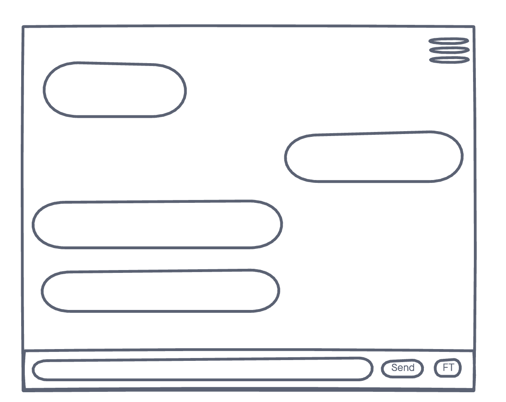
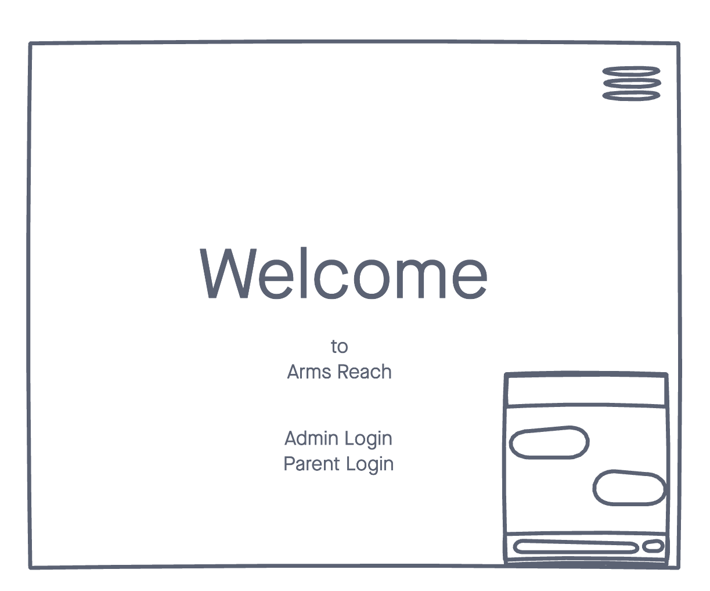

# Arms Reach
App intended to enable easy communication between Schools and Parents.

## ⚙️ Technologies Used
- CSS3
- React JS
- Styled Components
- Redux
- 
- Firebase
- Heroku (for deployment)

## 📸 Screenshots

## 🎬 Getting Started
[Click]() here to see the live app! 

## 🛠 Future Enhancements
- Finish building this app on Expo. 
- Find dependecies that will enable face chat and picture uploads to firebase on the webapp. (Solid alternative to expo camera & image-picker)

- Learned how to build this app from tutorial on youtube.